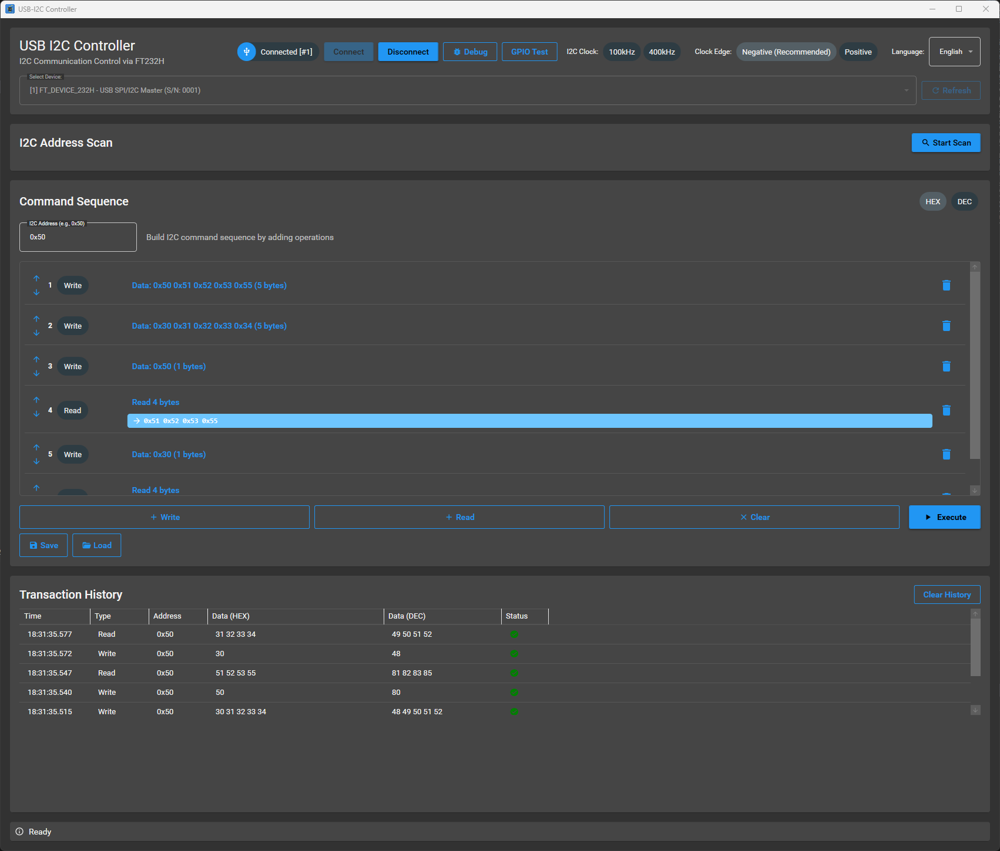

<div align="center">
  <h1><code>USB I2C Controller - FT232H</code></h1>
  <p>
    
  </p>
</div>

## Windows application for I2C communication control using FT232H

## Overview

This application is a GUI tool for communicating with I2C devices from Windows, using the FTDI FT232H chip as a USB-I2C bridge.

## Key Features

- ✅ **FT232H USB Connection**: Automatic detection and connection of FT232H devices
- ✅ **Multiple Device Support**: Select and use from multiple connected FT232H devices
- ✅ **I2C Address Scanning**: Automatically detect devices on the I2C bus (0x03~0x77)
- ✅ **I2C Write**: Send data to specified I2C addresses
- ✅ **I2C Read**: Read data from I2C devices
- ✅ **HEX/DEC Input**: Input and display data in HEX or DEC format
- ✅ **Transaction History**: Record all I2C communications as history
- ✅ **Modern UI**: User-friendly interface with Material Design

## Requirements

### Hardware
- FTDI FT232H module
- I2C device (target device to connect)

### Software
- Windows 10/11
- .NET 9.0 Runtime
- FTDI D2XX Driver (download from [FTDI official site](https://ftdichip.com/drivers/d2xx-drivers/))

## Installation

### 1. Install FTDI D2XX Driver

1. Download the D2XX driver for Windows from [FTDI official site](https://ftdichip.com/drivers/d2xx-drivers/)
2. Run the downloaded installer to install the driver
3. Connect the FT232H device to USB and verify it's recognized in Device Manager

### 2. Build Application or Download Release Binary

```powershell
# Clone repository (or navigate to existing folder)
cd UsbI2cController

# Build
dotnet build

# Run
dotnet run
```

if you prefer not to build from source, download the latest release binary from the [Releases](https://github.com/hnaka/UsbI2cController/releases) page.

## Usage

### 1. Device Selection and Connection

1. Connect FT232H to USB port
2. Launch the application (automatically detects devices)
3. **If multiple FT232H devices exist**:
   - Select the device to use from the device selection dropdown
   - Use the "Refresh" button to rescan the device list
4. Click the "Connect" button to connect to the FT232H
5. Verify that the device status shows "Connected"

### 2. Scan I2C Addresses

1. After connecting to the device, click the "Start Scan" button
2. Scan the I2C bus (0x03~0x77) to detect devices
3. Detected addresses are displayed as buttons
4. **Clicking an address button** automatically inputs that address into the I2C address field
5. A progress bar is displayed during scanning

### 3. I2C Write

1. Enter the target device address in the **I2C Address** field (e.g., `0x50`)
   - Or click a detected address from the scan to auto-input
2. Select **Data Format** (HEX or DEC)
3. Enter the data to send in the **Data** field
   - HEX format examples: `0x1A 0x2B 0x3C` or `1A 2B 3C`
   - DEC format example: `26 43 60`
4. Click the "Execute Write" button

### 4. I2C Read

1. Enter **Read Byte Count** (1~256)
2. Click the "Execute Read" button
3. Read data is displayed in the **Read Data** field

### 5. Data Format Switching

- Switch input/display format using **HEX/DEC radio buttons**
- Existing displayed data is automatically converted when switching

### 6. Multiple Device Management

- When multiple FT232H devices are connected, each device is identified by index number, description, and serial number
- Device selection dropdown display format: `[Index] Description (S/N: Serial Number)`
- Cannot switch devices while connected (disconnect first, then select another device)

## Data Input Formats

### HEX Format
Supports the following formats:
- `0x1A 0x2B 0x3C` (with 0x prefix, space-separated)
- `1A 2B 3C` (space-separated)
- `1A,2B,3C` (comma-separated)
- `1A2B3C` (continuous input)

### DEC Format
Supports the following formats:
- `26 43 60` (space-separated)
- `26,43,60` (comma-separated)

## FT232H Wiring

Example wiring when using FT232H as I2C master:

| FT232H Pin | I2C Signal | Connection |
|-----------|---------|--------|
| AD0 (SCL) | I2C Clock | SCL |
| AD1/AD2 (SDA) | I2C Data | SDA |
| GND | Ground | GND |

※Pull-up resistors (typically 4.7kΩ) are required for I2C devices

## I2C Address Scan Feature

### Scan Range
- **Start Address**: 0x03 (0x00~0x02 are reserved addresses)
- **End Address**: 0x77 (0x78~0x7F are reserved addresses)
- **Total**: Scans 117 addresses

### Usage
1. After connecting the device, click the "Start Scan" button
2. A progress bar is displayed during scanning
3. Detected addresses are displayed as buttons
4. Clicking an address button automatically inputs it into the I2C address field

### Using Scan Results
- Detected addresses are displayed in `0x??` format
- Select address and communicate with a single click
- If multiple devices are detected, all are displayed

### Notes
- Scanning may take several seconds
- Some devices may not respond to scanning
- Do not perform other operations during scanning

## Troubleshooting

### No Device Found in I2C Scan
- Verify pull-up resistors are properly connected
- Verify I2C device power is on
- Check for poor wire connections
- Verify device I2C address is within scan range (0x03~0x77)

### Device Not Detected
- Verify FTDI D2XX driver is properly installed
- Verify FT232H is recognized in Device Manager
- Try changing USB cable

### Communication Error
- Verify I2C address is correct (uses 7-bit address)
- Verify wiring is correct (SCL, SDA, GND)
- Verify pull-up resistors are connected
- Verify I2C device power is on

### Application Won't Start
- Verify .NET 9.0 Runtime is installed
- Check .NET version with `dotnet --version`

## Project Structure

```
UsbI2cController/
├── Services/
│   └── FT232HI2CService.cs      # FT232H I2C communication service
├── ViewModels/
│   └── MainViewModel.cs          # Main view model (MVVM)
├── Models/
│   └── I2CTransaction.cs         # Transaction data model
├── Converters/
│   ├── DataFormatConverter.cs    # HEX/DEC conversion utility
│   └── ValueConverters.cs        # XAML value converters
├── MainWindow.xaml               # Main UI design
├── MainWindow.xaml.cs            # Main window code-behind
├── App.xaml                      # Application resources
└── UsbI2cController.csproj       # Project file
```

## Technologies Used

- **.NET 9.0** - Framework
- **WPF** - UI Framework
- **Material Design in XAML** - Modern UI theme
- **CommunityToolkit.Mvvm** - MVVM pattern implementation
- **FTD2XX_NET** - C# wrapper for FTDI D2XX library

## License

This project is released under the MIT License.

## Reference Links

- [FTDI FT232H Datasheet](https://ftdichip.com/wp-content/uploads/2020/07/DS_FT232H.pdf)
- [FTDI D2XX Driver](https://ftdichip.com/drivers/d2xx-drivers/)
- [Material Design in XAML](http://materialdesigninxaml.net/)

## Support

If you encounter problems, please report them in the GitHub Issues section.
